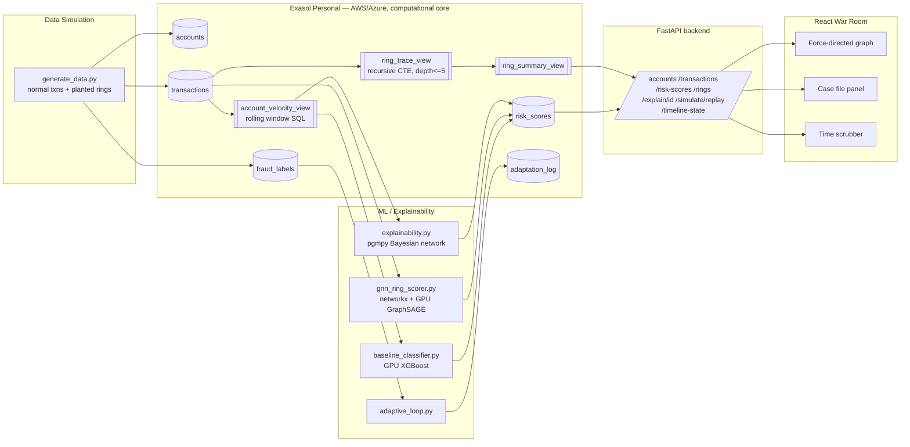

# AEGIS
**Adaptive Graph-Based UPI Fraud Detection & Explainable Money-Trail Tracing**
Track: *Predict, Detect & Optimize*

AEGIS detects coordinated multi-account UPI fraud rings (smurfing, layering,
mule networks) — not just single suspicious transactions — explains *why*
each account was flagged, and traces the full money trail. Exasol Personal
is the active computational core: rolling-window velocity features and
multi-hop path tracing are computed as SQL views inside the database, not
recomputed in pandas.

---

## Architecture



### Why Exasol is the core, not just storage
- `account_velocity_view` (`/sql/02_account_velocity_view.sql`) computes rolling
  1h/24h/30d transaction counts, sums, averages, standard deviations, and
  z-score-style amount deviation — all via Exasol analytic window functions
  (`RANGE BETWEEN ... PRECEDING`). The backend `SELECT`s this view directly;
  these numbers are never recomputed in pandas.
- `ring_trace_view` (`/sql/03_ring_trace_view.sql`) is a **recursive CTE**
  that walks the transaction graph up to 5 hops forward in time, with cycle
  guards, entirely in SQL — this is how layering/mule chains are traced.
- `ring_summary_view` aggregates those traces into ring candidates for the
  API and the UI's case-file panel.

---

## Repo layout

```
/simulation   synthetic UPI data generator + Exasol connection helper
/sql          schema + the two mandatory Exasol views + ring summary view
/backend      FastAPI service (reads Exasol, exposes REST API)
/ml           baseline XGBoost, graph/GNN ring scorer, Bayesian explainability,
              adaptive loop, and the pipeline orchestrator that ties them together
/frontend     React "War Room" UI (force graph, case files, time scrubber)
```

---

## Quick start

**Prerequisites:** Docker + Docker Compose. GPU support (NVIDIA Container
Toolkit) is optional — everything falls back to CPU automatically.

```bash
git clone <this-repo> aegis && cd aegis
# First, deploy Exasol Personal via the Launcher CLI (exasol install aws/azure/local)
cp .env.example .env
# Edit .env and fill in real values from `exasol info`
docker compose up -d
./run_demo.sh          # waits for services, seeds Exasol, runs the pipeline
```

Then open **http://localhost:3000** for the War Room UI.

`run_demo.sh` does three things once containers are healthy:
1. Runs `simulation/generate_data.py` inside the backend container — this
   creates the Exasol schema/views and loads accounts, transactions, and
   fraud labels (normal traffic + planted smurfing/layering/mule rings).
2. Calls `POST /pipeline/run`, which trains the baseline XGBoost classifier
   on `account_velocity_view`, scores ring membership via the graph/GNN
   layer, generates Bayesian explanations, and writes it all to
   `risk_scores`.
3. Tells you the UI is ready.

To manually re-run just the scoring pipeline later (e.g. after the
adaptive-loop demo adds new transactions):
```bash
curl -X POST http://localhost:8000/pipeline/run
```

To trigger the adaptive-loop stretch demo (rings mutate to smaller/slower
transactions; the system logs a threshold adjustment):
```bash
curl -X POST http://localhost:8000/adapt/run
```

---

## API reference

| Endpoint | Description |
|---|---|
| `GET /accounts` | All simulated accounts |
| `GET /transactions?since=` | Transactions, optionally from a timestamp |
| `GET /risk-scores` | Per-account model + ring scores + explanation |
| `GET /rings` | Ring candidates from `ring_summary_view` |
| `GET /rings/{root_account_id}/trace` | Full hop-by-hop path (from `ring_trace_view`) |
| `GET /explain/{account_id}` | Bayesian plain-language explanation for one account |
| `POST /simulate/replay` | Resets the server-side replay cursor |
| `GET /timeline-state?t=` | Network snapshot as of simulated time `t` |
| `POST /pipeline/run` | Re-run baseline + graph + Bayesian scoring |
| `POST /adapt/run` | Run the adaptive-loop stretch scenario |

---

## Build order this repo follows (matches the brief)

1. **Infrastructure** — `docker-compose.yml`, one-command startup.
2. **Data simulation** — `simulation/generate_data.py`.
3. **Exasol SQL layer** — `sql/02_account_velocity_view.sql`,
   `sql/03_ring_trace_view.sql` (the top-weighted piece).
4. **Detection: baseline** — `ml/baseline_classifier.py` (GPU XGBoost,
   CPU fallback). This is the safe layer that always works.
5. **Detection: graph/GNN** — `ml/gnn_ring_scorer.py`. Falls back to a
   networkx-only heuristic score if `torch_geometric` isn't installed —
   never breaks the baseline demo.
6. **Explainability** — `ml/explainability.py` (pgmpy Bayesian network).
7. **Adaptive loop (stretch)** — `ml/adaptive_loop.py`.
8. **Backend API** — `backend/main.py`.
9. **Frontend War Room** — `frontend/src/App.jsx`.

Each stage is additive: if you stop after step 4, `/risk-scores` still
returns real, working baseline scores; the UI degrades to showing 0 for
`ring_membership_score` and a generic explanation rather than crashing.

---

## Deployment notes

See `DEPLOYMENT.md` for running Exasol Personal locally in more detail,
resource sizing, and brief notes on AWS/Azure deployment.
